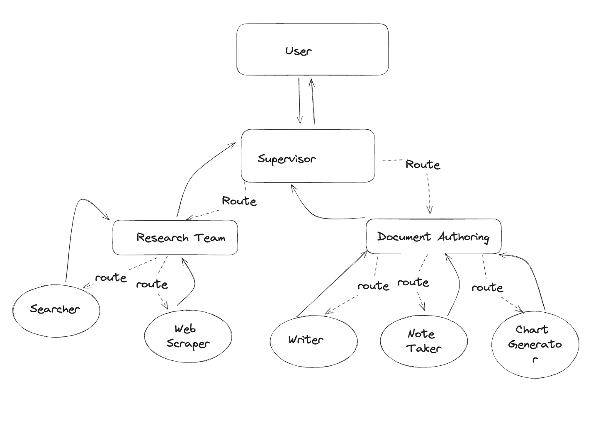

:orphan:

.. _advanced_examples:

Advanced Examples
#################

.. contents:: Table of Contents

Preface
*******
As advanced examples, we are going to use the following tutorials from LangGraph:

* `Agent Architectures - Multi-Agent Network <https://langchain-ai.github.io/langgraph/tutorials/multi_agent/multi-agent-collaboration/>`_
* `Agent Architectures - Multi-Agent Supervisor <https://langchain-ai.github.io/langgraph/tutorials/multi_agent/agent_supervisor/>`_
* `Agent Architectures - Hierarchical Agent Teams <https://langchain-ai.github.io/langgraph/tutorials/multi_agent/hierarchical_agent_teams/>`_

We are also not going to focus on a basic usage - the main focus is going to be on :class:`langgraph_log_parser.jsons_to_csv.GraphConfig`.

If You want to check basic usage, refer to: :ref:`getting_started`.

Multi-Agent Network
*******************
This example is based on `Agent Architectures - Multi-Agent Network <https://langchain-ai.github.io/langgraph/tutorials/multi_agent/multi-agent-collaboration/>`_ and expands on :ref:`exporting_jsons_to_csv` from :ref:`getting_started`.

.. figure:: img/collaboration.png
  :width: 800

  `Multi-Agent Network diagram - LangGraph Documentation <https://langchain-ai.github.io/langgraph/tutorials/multi_agent/multi-agent-collaboration/>`_

The premise of this example is to show that :code:`GraphConfig` can have multiple nodes.

In case of this example - we will have 3 nodes - :code:`Researcher`, :code:`chart_generator` and :code:`call_tool`.

**Example:**

.. code-block:: python

    # Needed imports
    from langgraph_log_parser.experiment import create_experiment
    from langgraph_log_parser.jsons_to_csv import GraphConfig, export_jsons_to_csv

    # Init for experiment project structure
    exp = create_experiment("test")

    # We can add multiple nodes!
    graph_config = GraphConfig(
        nodes=['Researcher','chart_generator', 'call_tool']
    )

    # You can provide You own file name as an optional attribute csv_path.
    # Otherwise it will use the default file name - "csv_output.csv"
    export_jsons_to_csv(exp, graph_config)

Multi-Agent Supervisor
**********************
This example is based on `Agent Architectures - Multi-Agent Supervisor <https://langchain-ai.github.io/langgraph/tutorials/multi_agent/agent_supervisor/>`_. It introduces the concept of a :code:`Supervisor` - a node that controls other nodes.

.. figure:: img/supervisor.png
  :width: 800

  `Multi-Agent Supervisor diagram - LangGraph Documentation <https://langchain-ai.github.io/langgraph/tutorials/multi_agent/agent_supervisor/>`_

In this example, we will introduce :class:`langgraph_log_parser.jsons_to_csv.SupervisorConfig`. It will supervise the graph - working more or less work the same as :code:`GraphConfig`. The concept of supervisors will make more sense in :ref:`hierarchical_agent_teams`.

**Example:**

.. code-block:: python

    # Needed imports
    from langgraph_log_parser.experiment import create_experiment
    from langgraph_log_parser.jsons_to_csv import GraphConfig, SupervisorConfig, export_jsons_to_csv

    # Init for experiment project structure
    exp = create_experiment("test")

    # Supervisor for graph
    supervisor = SupervisorConfig(
        name="supervisor",
        supervisor_type="graph"
    )

    # Config with supervisor and additional nodes
    graph_config = GraphConfig(
        supervisors=[supervisor],
        nodes=["Researcher", "Coder"]
    )

    # You can provide You own file name as an optional attribute csv_path.
    # Otherwise it will use the default file name - "csv_output.csv"
    export_jsons_to_csv(exp, graph_config)

.. _hierarchical_agent_teams:

Hierarchical Agent Teams
************************
This example is based on `Agent Architectures - Hierarchical Agent Teams <https://langchain-ai.github.io/langgraph/tutorials/multi_agent/hierarchical_agent_teams/>`_. It introduces the concept of a :code:`SubgraphConfig` - a node that controls other nodes.

  `Hierarchical Agent Teams diagram - LangGraph Documentation <https://langchain-ai.github.io/langgraph/tutorials/multi_agent/hierarchical_agent_teams/>`_

In this example, we have a :code:`Graph` that is build from two :code:`SubGraphs`. Those graphs are controlled by a :code:`Supervisor` - that routes traffic to subgraphs.
Furthermore, every graph has its own supervisor - that controls what is happening inside of it.

IMPORTANT: Be sure to call supervisors with different names - so you can differentiate between them! Calling supervisors with the same names WILL brake the parser.

**Example:**

.. code-block:: python

    # Needed imports
    from langgraph_log_parser.experiment import create_experiment
    from langgraph_log_parser.jsons_to_csv import GraphConfig, SubgraphConfig, SupervisorConfig, export_jsons_to_csv

    # Init for experiment project structure
    exp = create_experiment("test")

    # Config for entire graph supervisor
    graph_supervisor = SupervisorConfig(
        name="graph_supervisor",
        supervisor_type="graph"
    )

    # Config for Research Team subgraph supervisor
    research_supervisor = SupervisorConfig(
        name="research_supervisor",
        supervisor_type="subgraph"
    )

    # Config for Paper Writing Team subgraph supervisor
    paper_supervisor = SupervisorConfig(
        name="paper_supervisor",
        supervisor_type="subgraph"
    )

    # Config for Research Team subgraph
    research_team = SubgraphConfig(
        name="ResearchTeam",
        nodes=["Search", "WebScraper"],
        supervisor=research_supervisor
    )

    # Config for Paper Writing Team subgraph
    paper_team = SubgraphConfig(
        name="PaperWritingTeam",
        nodes=["DocWriter", "NoteTaker","ChartGenerator"],
        supervisor=paper_supervisor
    )

    # Config for complete graph
    graph_config = GraphConfig(
        supervisors=[graph_supervisor],
        subgraphs=[research_team, paper_supervisor]
    )

    # You can provide You own file name as an optional attribute csv_path.
    # Otherwise it will use the default file name - "csv_output.csv"
    export_jsons_to_csv(exp, graph_config)

Notice how:

* every supervisor has a config (both graph and subgraphs) - but they have a different :code:`supervisor_type`.
* every graph has a config (both graph and subgraphs) - but they are using different classes: :code:`GraphConfig` or :code:`SubgraphConfig`
* :code:`GraphConfig` doesn't have :code:`nodes` defined - since they are being taken care of by subgraphs.