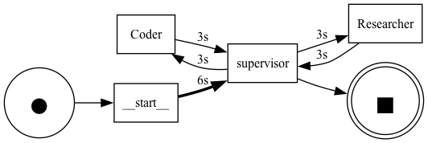
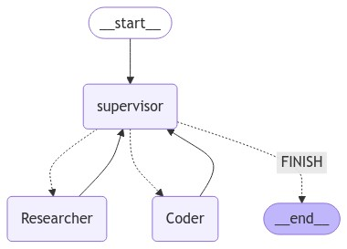
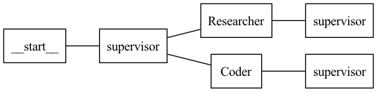

:orphan:

.. _getting_started:

Getting Started
###############

.. contents:: Table of Contents

Preface
*******
As an example, we are going to use a `Building a Basic Chatbot <https://langchain-ai.github.io/langgraph/tutorials/introduction/#part-1-build-a-basic-chatbot>`_ from LangGraph documentation.

Setup
*****

Creating experiment
===================
First, start with creating an experiment folder structure for storing all of Your working data. The data by default will be stored in :code:`experiments` - a directory automatically created by a package
(however you are able to save it in another location by using optional :code:`base_dir` attribute).

To create an experiment, you can use the function :func:`langgraph_log_parser.experiment.create_experiment`.

This can be done like this:

.. code-block:: python

    from langgraph_log_parser.experiment import create_experiment

    exp = create_experiment("test")

Function should create a folder structure in :code:`experiments` containing folders :code:`csv`, :code:`db`, :code:`img`, :code:`json` and :code:`reports`.

.. code-block:: text

    experiments/
    └── test/
        ├── csv/
        ├── db/
        ├── img/
        ├── json/
        └── reports/

For more details, refer to the documentation of the :mod:`langgraph_log_parser.experiment` module.

Setting up the database
=======================
This package leverages `SqliteSaver <https://langchain-ai.github.io/langgraph/reference/checkpoints/#langgraph.checkpoint.sqlite.SqliteSaver>`_ from LangGraph which allows saving checkpoints in a SQLite database.

The benefit of using previously mentioned :code:`create_experiment` is the fact that You don't have to define the paths manually - you can just refer to the properties.

To initiate connection to SQLite database correctly, be sure to do the following:

.. code-block:: python

    from langgraph_log_parser.experiment import create_experiment

    # Init for experiment project structure
    exp = create_experiment("test")

    # Initiate connection
    memory = exp.memory

    # Rest of the code...

    # Remember to compile your graph with SQLite as checkpointer memory
    graph = graph_builder.compile(checkpointer=memory)

Running graph multiple times
============================
Since the aim of this package is to monitor and compare multi-agent architectures - we need to run the graphs multiple times to be able to compare the results.

Because of this, I've created :func:`langgraph_log_parser.graph_runner.run_multiple_iterations`.

This function will create a thread for every single run of the graph - starting from selected :code:`starting_thread_id`.

**Example:**

.. code-block:: python

    from langgraph_log_parser.graph_runner import run_multiple_iterations

    # Rest of the code... (building graph etc.)

    # Graph with SQLite checkpointer memory
    graph = graph_builder.compile(checkpointer=memory)

    # This takes graph and runs it 5 times - creating 1 thread for every single run, starting from thread_id=1
    run_multiple_iterations(graph, 1,5, {"messages": [("user", "Tell me a joke")]})

For more details, refer to the documentation of the :mod:`langgraph_log_parser.graph_runner` module.

Preparing data for analysis
===========================
Preparation of data can be easily achieved by using :func:`langgraph_log_parser.artifacts.prepare_data` from module :mod:`langgraph_log_parser.artifacts`.

However, before doing so I would strongly recommend to read documentation bellow since it shows how to use :code:`GraphConfig` - a custom class that defines how a graph was configured, so parser can parse accordingly.

If you want to see how to use :func:`langgraph_log_parser.artifacts.prepare_data` refer to :ref:`exporting_data`.

Exporting SQLite to JSON's
--------------------------
After running graph multiple times, we need to retrieve the data from the SQLite database.

For this, I've created a function :func:`langgraph_log_parser.sql_to_jsons.export_sqlite_to_jsons` that retrieves data from the database and deserializes it from :code:`msgpack`.

Post deserialization - function saves every single thread to a separate :code:`json` file.

Once again - the benefits of using :code:`create_experiment` - you can just refer directly to experiment.

**Example:**

.. code-block:: python

    # Needed imports
    from langgraph_log_parser.experiment import create_experiment
    from langgraph_log_parser.sql_to_jsons import export_sqlite_to_jsons

    # Init for experiment project structure
    exp = create_experiment("test")

    # Rest of the code...

    # Exporting using experiment
    export_sqlite_to_jsons(exp)

**Folder structure should like this now:**

.. code-block:: text

    experiments/
    └── test/
        ├── csv/
        ├── db/
        │   └── test.sqlite
        ├── img/
        ├── json/
        │   ├── thread_1.json
        │   ├── thread_2.json
        │   ├── thread_3.json
        │   ├── thread_4.json
        │   └── thread_5.json
        └── reports/

For more details, refer to the documentation of the :mod:`langgraph_log_parser.sql_to_jsons` module.

.. _exporting_jsons_to_csv:

Exporting JSON's to CSV
-----------------------
We retrieved the data from the database. Now it's time to create a :code:`csv` file that can be loaded as an event log.

For this, I've created :func:`langgraph_log_parser.jsons_to_csv.export_jsons_to_csv`.
This function takes every singe :code:`json` file from a selected directory and parses it - extracting all the necessary data to create an event log.
This requires :class:`langgraph_log_parser.jsons_to_csv.GraphConfig` a custom class that defines how a graph was configured, so parser can parse accordingly.

In this example, we will focus on a basic usage of :code:`GraphConfig`.
I dive deeper into :code:`GraphConfig` in :ref:`advanced_examples`.

**Example:**

In case of `Building a Basic Chatbot <https://langchain-ai.github.io/langgraph/tutorials/introduction/#part-1-build-a-basic-chatbot>`_, we have only one node called :code:`chatbot_node`.

Because of that, we will only have one node in :code:`nodes` list. Once graph config is defined, we can execute the needed method to export all JSON's to one :code:`csv` file.

In this case, You can also use the benefits of :code:`create_experiment`.

.. code-block:: python

    # Needed imports
    from langgraph_log_parser.experiment import create_experiment
    from langgraph_log_parser.jsons_to_csv import GraphConfig, export_jsons_to_csv

    # Init for experiment project structure
    exp = create_experiment("test")

    # Rest of the code...

    # Basic graph config
    graph_config = GraphConfig(
    nodes=["chatbot_node"]
    )

    # You can provide You own file name as an optional attribute csv_path.
    # Otherwise it will use the default file name - "csv_output.csv"
    export_jsons_to_csv(exp, graph_config)

**Folder structure should like this now:**

.. code-block:: text

    experiments/
    └── test/
        ├── csv/
        │   └── csv_output.csv
        ├── db/
        │   └── test.sqlite
        ├── img/
        ├── json/
        │   ├── thread_1.json
        │   ├── thread_2.json
        │   ├── thread_3.json
        │   ├── thread_4.json
        │   └── thread_5.json
        └── reports/

For more details, refer to the documentation of the :mod:`langgraph_log_parser.jsons_to_csv` module.

.. _exporting_data:

Exporting data using :code:`prepare_data`
-----------------------------------------
This function simplifies the process of exporting data to :code:`csv` file by running previously mentioned functions.

.. code-block:: python

    from langgraph_log_parser.experiment import create_experiment
    from langgraph_log_parser.jsons_to_csv import GraphConfig
    from langgraph_log_parser.artifacts import prepare_data

    # Init for experiment project structure
    exp = create_experiment("test")

    # Rest of the code...

    # Basic graph config
    graph_config = GraphConfig(
    nodes=["chatbot_node"]
    )

    prepare_data(exp, graph_config)

This function will run the :code:`export_sqlite_to_jsons` and :code:`export_jsons_to_csv` in order preparing the data for analysis.

Running analysis
================
We've successfully parsed JSON's into the :code:`csv` file. Now we can run analysis on the event log.

**I'm not going to go into details on every single function and what it does - we will focus on one that prints full analysis into the console - since it's the easiest way to see the analysis.**

You can find every function specification in modules here:

* :mod:`langgraph_log_parser.analyze` - for running analysis on every :code:`thread_id` `(case_id)`
* :mod:`langgraph_log_parser.analyze_case_id` - for running analysis on single :code:`thread_id` `(case_id)`

In both examples we will use :func:`langgraph_log_parser.load_events.load_event_log` from module :mod:`langgraph_log_parser.load_events` to load event log we will use in analysis.

Analysis on entire event log
----------------------------

In case of printing analysis for entire event log, we will use :func:`langgraph_log_parser.analyze.print_analysis` from module :mod:`langgraph_log_parser.analyze`.

.. code-block:: python

    # Needed imports
    from langgraph_log_parser.experiment import create_experiment
    from langgraph_log_parser.load_events import load_event_log
    from langgraph_log_parser.analyze import print_analysis

    # Init for experiment project structure
    exp = create_experiment("test")

    # Rest of the code...

    # Using experiment to load events from .csv file
    # You can also provide path directly as a string
    event_log = load_event_log(exp)

    # This function will print an analysis in console for entire event log
    print_analysis(event_log)

This will return information for every :code:`thread_id` `(case_id)` about the following:

* start activities
* end activities
* count of each activity (summed from every case)
* every sequence
* ID of last sequence occurrence with probability of occurrence
* minimal self-distances for every activity (on case basis)
* witnesses of minimum self-distances (on case basis)
* count of activity rework (on case basis)
* mean duration of every activity `(in sec)`
* duration of the case `(in sec)` (on case basis)

Analysis on single case_id
--------------------------

In case of printing analysis for single :code:`case_id`, we will use :func:`langgraph_log_parser.analyze_case_id.print_case_analysis` from module :mod:`langgraph_log_parser.analyze_case_id`.

.. code-block:: python

    # Needed imports
    from langgraph_log_parser.experiment import create_experiment
    from langgraph_log_parser.load_events import load_event_log
    from langgraph_log_parser.analyze_case_id import print_case_analysis

    # Init for experiment project structure
    exp = create_experiment("test")

    # Rest of the code...

    # Using experiment to load events from .csv file
    # You can also provide path directly as a string
    event_log = load_event_log(exp)

    case_id = 15

    # This function will print an analysis in console for single case_id
    print_case_analysis(event_log,case_id)

This will return information for single :code:`thread_id` `(case_id)` about the following:

* start activity
* end activity
* count of each activity
* sequence of activities with probability of occurrence for the sequence
* minimal self-distances for every activity
* witnesses of minimum self-distances
* count of activity rework
* sum service time of every activity (in sec)
* duration of the case (in sec)

Generation
**********
You can easily generate visualizations and reports using :func:`langgraph_log_parser.artifacts.generate_artifacts`.
This function will generate visualizations and reports for entire event log.

.. code-block:: python

    # Needed imports
    from langgraph_log_parser.experiment import create_experiment
    from langgraph_log_parser.load_events import load_event_log
    from langgraph_log_parser.artifacts import generate_artifacts

    # Init for experiment project structure
    exp = create_experiment("test")

    # Rest of the code...

    # Graph is needed for the mermaid graph
    graph = graph_builder.compile(checkpointer=memory)

    # Using experiment to load events from .csv file
    # You can also provide path directly as a string
    event_log = load_event_log(exp)

    # Function for generating and saving reports for entire event_log via experiment
    generate_artifacts(event_log, graph, exp)

If you would like to generate it manually, you can refer to the sections below.

Creating visualizations
=======================
We are going to use :func:`langgraph_log_parser.visualize.generate_visualizations` to generate and save every visualization available.

You can find every function specification in module :mod:`langgraph_log_parser.visualize`.

Once again, utilize the :code:`create_experiment` properties.

.. code-block:: python

    # Needed imports
    from langgraph_log_parser.experiment import create_experiment
    from langgraph_log_parser.load_events import load_event_log
    from langgraph_log_parser.visualize import generate_visualizations

    # Init for experiment project structure
    exp = create_experiment("test")

    # Rest of the code...

    # Graph is needed for the mermaid graph
    graph = graph_builder.compile(checkpointer=memory)

    # Using experiment to load events from .csv file
    # You can also provide path directly as a string
    event_log = load_event_log(exp)

    # Function saving every visualisation - via experiment
    generate_visualizations(event_log, graph, exp)

**Folder structure should like this now:**

.. code-block:: text

    experiments/
    └── test/
        ├── csv/
        │   └── csv_output.csv
        ├── db/
        │   └── test.sqlite
        ├── img/
        │   ├── dfg_performance.png
        │   ├── mermaid.png
        │   └── prefix_tree.png
        ├── json/
        │   ├── thread_1.json
        │   ├── thread_2.json
        │   ├── thread_3.json
        │   ├── thread_4.json
        │   └── thread_5.json
        └── reports/

**Sample graphs:**

This graph can also be generated using :func:`langgraph_log_parser.visualize.generate_performance_dfg`.

  Sample performance dfg

This graph can also be generated using :func:`langgraph_log_parser.visualize.generate_mermaid`.

  Sample mermaid graph

This graph can also be generated using :func:`langgraph_log_parser.visualize.generate_prefix_tree`.

  Sample prefix tree

Generating JSON report for entire Event Log
===========================================
We can generate report for entire :code:`event_log`.
The report will be saved in a :code:`json` format and will be used in a HTML comparison report.

As in previous cases, we can use :code:`create_experiment` properties.

In case of entire log, we will need to use a :func:`langgraph_log_parser.create_report.generate_reports`.

.. code-block:: python

    # Needed imports
    from langgraph_log_parser.experiment import create_experiment
    from langgraph_log_parser.load_events import load_event_log
    from langgraph_log_parser.create_report import generate_reports

    # Init for experiment project structure
    exp = create_experiment("test")

    # Rest of the code...

    # Using experiment to load events from .csv file
    # You can also provide path directly as a string
    event_log = load_event_log(exp)

    # Function for generating and saving reports for entire event_log via experiment
    generate_reports(event_log, exp)

**Folder structure should like this now:**

.. code-block:: text

    experiments/
    └── test/
        ├── csv/
        │   └── csv_output.csv
        ├── db/
        │   └── test.sqlite
        ├── img/
        │   ├── dfg_performance.png
        │   ├── mermaid.png
        │   └── prefix_tree.png
        ├── json/
        │   ├── thread_1.json
        │   ├── thread_2.json
        │   ├── thread_3.json
        │   ├── thread_4.json
        │   └── thread_5.json
        └── reports/
            ├── metrics_report.json
            └── sequences_report.json

Generating architecture comparison
**********************************
You can generate architecture comparison report by executing :func:`langgraph_log_parser.create_html.compare` and
supplying the metod with the list of architectures You would like to compare. Function will look for experiments
by default in the :code:`experiments` folder `(however if needed - You can specify the paths directly)`. After generating the function should automatically save the report in:
:code:`comparison_reports` directory and open the report in Your default browser.

.. code-block:: python

    # Needed imports
    from langgraph_log_parser.create_html import compare

    # List the experiments you would like to compare
    infrastructures = ["test_1", "test_2"]

    # Run the function to generate comparison report
    compare(infrastructures)

This should generate the HTML report called :code:`test_1_vs_test_2.html` in :code:`comparison_reports` directory.